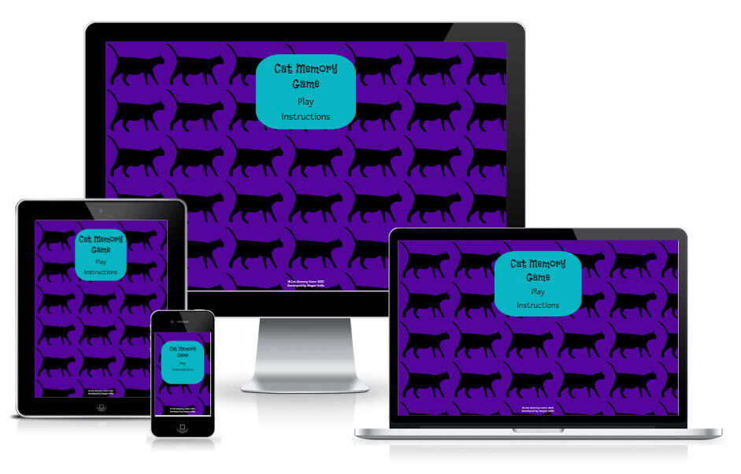
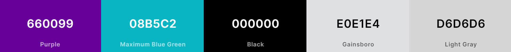
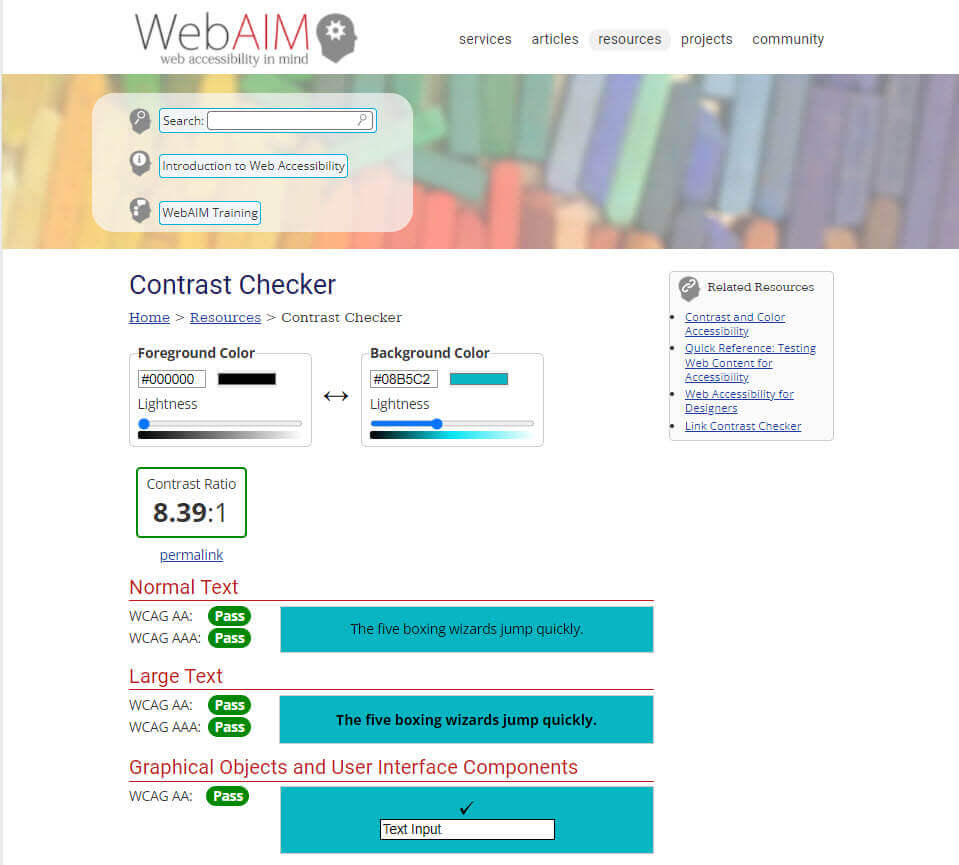
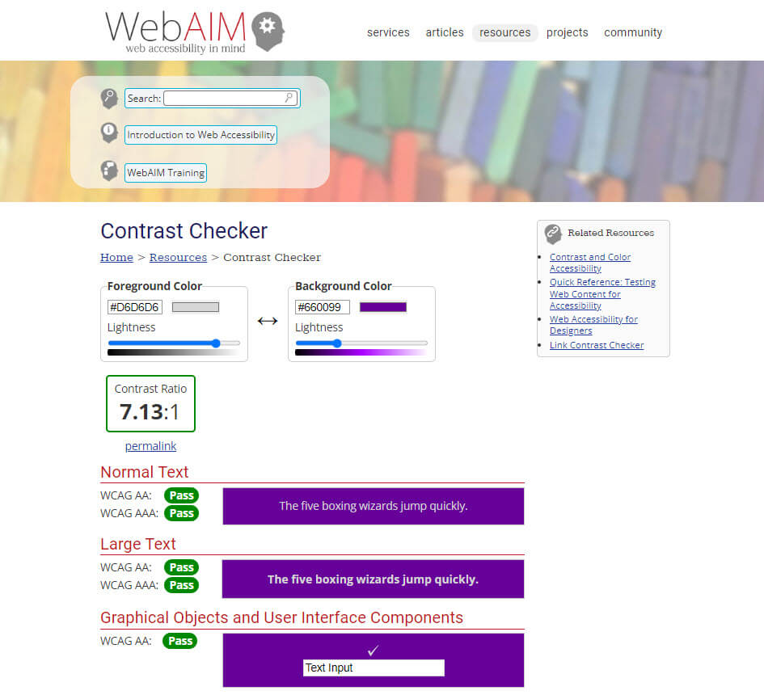

<h1 align="center">Cat Memory Game</h1>

<h3>Stream Two Project - Interactive Frontend Development</h3>
 

[View the deployed Cat Memory Game](https://medusas71.github.io/Cat-Memory-Game/)

**Please note: To open any links in this document in a new browser tab, press 'CTRL + Click'.**

# Table of Contents

<b>(click to expand or hide)</b>

<!-- Markdown TOC -->

1. [Description](#description)
2. [User Experience (UX)](#user-experience-(ux))
   * [User Stories](#user-stories)
   * [5 Planes](#5-planes)
     1. [Strategy](#strategy)
     2. [Scope](#scope)
     3. [Structure](#structure)
     4. [Skeleton](#skeleton)
     5. [Surface](#surface)
3. [Features](#features)
   * [Current Features](#current-features)
   * [Future Features](#future-features)
4. [Technologies Used](#technologies-used)
5. [Testing](#testing)
6. [Lessons Learned](#lessons-learned)
7. [Deployment](#deployment)
8. [Credits](#credits)

<!-- /Markdown TOC -->

# Description  

I am currently studying the Full Stack Development Course through Code Institute.
Part of the course I am required to complete 4 milestone projects.
This memory game is my second milestone project which is part of the 
Interactive Frontend Development Module.

The cat memory game has been created for people of all ages that love cats &#128570; and 
would like to test their memory.
The purpose of this website is to improve brain functionality such as focus, 
concentration and attention and to also have fun. &#128062;

[Back to Table of Contents](#table-of-contents)

# User Experience (UX)

## User Stories

Players Goals

* As a player, I would like to:
  * improve my concentration skills
  * improve my focus skills
  * improve my attention to detail
  * have clear instructions on how to play the game
  * be able to increase the level of difficulty to improve brain functionality
  * exit the game at any time
  * be able to restart the level 
  * click a card, the card flips and displays a cat picture
  * have the cards that matched, stay flipped so I know exactly how many cards are left to play
  * be able to click the cards as many times as required until the matching pair displays
  * have fun

[Back to Table of Contents](#table-of-contents)

## 5 Planes

### 1. Strategy

The purpose of this project is to create a fun memory game for people of any age 
where they are looking for two cat cards that have the same image.
I have decided to use cats as images as they are one of my favourite animals.

### 2. Scope

The features of this project will include:

* The ability to:
  * find two matching cat images
  * improve concentration skills
  * improve focus skills
  * improve attention to detail
  * read clear instructions on how to play the game
  * increase the level of difficulty to improve brain functionality
  * exit the game at any time
  * be able to restart the level
  * see a cat image when flipping a card
  * keep the matching cards flipped
  * click a particular card again if the cards do not match

### 3. Structure

The website consists of three pages:

* A Home Page that includes instructions on how to play the game;
* A Level 1 Page that includes the cat cards to play the game;
* A Level 2 Page that includes more cat cards than level 1 to play the game.
 
The information is grouped logically for all game players. The Interaction Design (IXD) 
will be consistent between pages with the only difference being that there are more cards 
displaying on Level 2 compared to Level 1, to increase the difficulty. Once the user has 
played the game, a modal displays advising that the level has been completed so game players 
have clear feedback regarding the game status.

### 4. Skeleton

The wireframes have been created using [Balsamiq](https://balsamiq.com/) and were created for Desktop, Tablet and Phone.

These wireframes initially included the ability to replay a level on completion. This has now been removed from the Scope
and User Stories and placed as an additional feature but has not been removed from the wireframes.

Here are the [wireframes](./documents/cat-memory-game.pdf):

* [Home Page Wireframe](./readme-images/wireframes/homepage.png)
* [Instructions Wireframe](./readme-images/wireframes/instructions.png)
* [Level 1 - 12 Cards Wireframe](./readme-images/wireframes/level1-12-cards.png)
* [1st Level Complete Wireframe](./readme-images/wireframes/1st-level-complete.png)
* [Level 2 - 16 Cards Wireframe](./readme-images/wireframes/level2-16-cards.png)
* [2nd Level Complete Wireframe](./readme-images/wireframes/2nd-level-complete.png)
* [404 Error Wireframe](./readme-images/wireframes/404-error.png)

### 5. Surface 

Colour Scheme

* I made the background colour of the pages purple #660099 for two reasons. 
  1. Purple is a royal colour and cats think they are royalty. 
  2. My favourite colour is purple.
* I then wanted a blue/green colour to compliment the purple. I selected a Maximum Blue Green #08B5C2.
* I originally kept the text colour generic and used Black #000 in some parts, however this 
did not meet accessibility guidelines so I changed the Black #000 to Light Grey #D6D6D6.
* I used a Gainsboro colour #E0E1E4 for some of the other text, such as copyright information in the footer, 
the numbers on level 1 and level 2 and the exit and restart game buttons. 
* I originally used white, however the white was too bright on the screen.
* The hover colour is Gainsboro #E0E1E4 when hovered over the black text on the homepage.
* The buttons hover colour on Level 1 and Level 2 is Black #000.

Colours sourced using [Coolors](https://coolors.co/660099-08b5c2-000000-e0e1e4)

* The colours were checked through [WebAIM](https://webaim.org/resources/contrastchecker/) to ensure that the colours 
were accessible.
* The black against the purple was not accessible and did not pass the contrast checker, so the black was changed to light 
grey which passed the accessibility test.

Typography

* The fonts were sourced from [Google Fonts](https://fonts.google.com/).
* The Fresca font is the main font used throughout the website with sans-serif as the fallback font.
This font was chosen as it compliments the Flavors font that is used for the titles.
* The Flavors font was used for all headings with sans-serif as the fallback font.
This font was chosen for its funky text that I thought would look good in a game.

Imagery

* The background image for the homepage was sourced from [pngset](https://pngset.com/download-free-png-yaylz) and 
was modified for use.
* The same image used in the homepage background, has been used on the back of each card.
* All cat images used for the cards were sourced from [Unsplash](https://unsplash.com/).
* The 404 vector created by [freepik](https://www.freepik.com/vectors/404'>).

[Back to Table of Contents](#table-of-contents)

# Features

**Current Features**

Each page features:

* The same colours on every page for consistency.
* A copyright and developed by on the footer of each page.

The Home Page features:

* The name of the game, a "Play" button and an "Instruction" button.
  * The "Instruction" button displays a modal with the instructions that can be 
closed by clicking either the "x" button, the "close" button or by clicking anywhere 
on the screen.
  * The "Play" button takes the user to Level 1 of the game.

The Level 1 Page features:

* 12 cards, a "Timer", "Pairs", "Moves", an "Exit" button and a "Restart" button.
  * The user can either start playing the game by clicking a card; or
  * The user can click the "Exit" button and is taken to the Home Page; or
  * The user can click the "Restart" button where the cards will be shuffled by 
  reloading the page and the user can start the game again. The Timer resets to 
  60 seconds and the Pairs and Moves reset to 0.
  * Once the user starts the game, the Timer displays a 60 second countdown to 0.
  * If the timer runs out before the user can find all the matching cards, then a 
  modal displays advising the user that they have run out of time.
  * Once a user finds a matching pair, the Pairs number increases accordingly.
  * Once a user clicks a card, the Moves number increases accordingly.
  * One feature on Level 1 is that if the 2 cards chosen are incorrect the cards 
  will stay displayed on the screen until a user clicks a 3rd card. The user is 
  unaware of this, but it is a feature that allows the cards to stay displayed 
  longer to the user.
  * On completion of Level 1 a "Congratulations" modal displays and two buttons which consist
of "Next Level" and "Close".
  * If "Next Level" is clicked the user is taken to the 2nd level which is the 3rd 
  page of the website.
  * If "Close" is clicked, the user is taken back to the main menu.

The Level 2 Page features:

* 16 cards, a "Timer", "Pairs", "Moves", an "Exit" button and a "Restart" button.
  * The user can either start playing the game by clicking a card; or
  * The user can click the "Exit" button and is taken to the Home Page; or
  * The user can click the "Restart" button where the cards will be shuffled by 
  reloading the page and the user can start the game again. The Timer resets to 
  90 seconds and the Pairs and Moves reset to 0.
  * Once the user starts the game, the Timer displays a 90 second countdown to 0.
  * If the timer runs out before the user can find all the matching cards, then a 
  modal displays advising the user that they have run out of time.
  * Once a user finds a matching pair, the Pairs number increases accordingly.
  * Once a user clicks a card, the Moves number increases accordingly.
  * One feature on Level 2 is that if the 2 cards chosen are incorrect the cards 
  will stay displayed on the screen until a user clicks a 3rd card. The user is 
  unaware of this, but it is a feature that allows the cards to stay displayed 
  longer to the user.
  * On completion of Level 2 a "Congratulations" modal displays with one "Close" button 
where the user is taken back to the main menu.

**Future Features to implement**

* The ability to replay the level that I am on after completing that level.
* To have the time and moves display on the completion modal, so I know how long I took 
and how many moves it took to complete the game.
* A leader board so I can see if I can beat my own high score.
* A leader board where I can try and beat other users high score.
* More levels.

[Back to Table of Contents](#table-of-contents)

# Technologies Used

Languages Used

1. [HTML5](https://en.wikipedia.org/wiki/HTML5)
2. [CSS3](https://en.wikipedia.org/wiki/CSS)
3. [JavaScript](https://en.wikipedia.org/wiki/JavaScript)

Frameworks, Libraries, Programs and Resources Used

<!-- Created Ordered Lists via markdown style guide. I didn't want to have to keep updating the numbers in this list
when I added more information to this -->

1. [Am I Responsive](https://ui.dev/amiresponsive) - to create a Home Page image on each device for use in the Readme file
1. [Autoprefixer CSS Online](https://autoprefixer.github.io/) - to ensure all vendor prefixes were included in CSS
1. [Balsamiq](https://balsamiq.com/) - wireframes
1. [Bootstrap 4.6 CDN](https://getbootstrap.com/docs/4.6/getting-started/introduction/) - to make the website responsive and to use modals
1. [Code Institute course content](https://learn.codeinstitute.net/login?next=/) - main source of fundamental knowledge
1. [Coolors](https://coolors.co/) - to display colour palettes
1. [Favicon Generator](https://favicon.io/emoji-favicons/) - to generate the favicon from an emoji
1. [Freepik](https://www.freepik.com/) - 404 error page
1. [Git](https://git-scm.com/) - version control
1. [GitHub](https://github.com/) - hosting service 
1. [GitPod](https://www.gitpod.io/) - IDE
1. [Google Fonts](https://fonts.google.com/) - typography
1. [jQuery](https://jquery.com/) - for the modal
1. [Lighthouse](https://developers.google.com/web/tools/lighthouse) - to check for issues on all pages
1. [Markdown Guide](https://www.markdownguide.org/basic-syntax/) - for creating this numbered list and not having to number each item individually
1. [pngset](https://pngset.com/) - for background cat image
1. [Slack](https://slack.com/) - main source of assistance from other students, developers and documents/resources
1. [Snagit](https://www.techsmith.com/screen-capture.html) - screen capture, resizing images and adding background colour to images
1. [Stack overflow](https://stackoverflow.com/) - for resolving specific issues
1. [TinyPNG](https://tinypng.com/) - efficient compression of images for the site
1. [Unsplash](https://unsplash.com/) - for cat images on cards
1. [W3Schools](https://www.w3schools.com/) - to assist with code
1. [Wave](https://wave.webaim.org/) - to ensure the content was accessible
1. [WebAIM](https://webaim.org/resources/contrastchecker/) - web accessibility contrast checker

[Back to Table of Contents](#table-of-contents)

# Testing

[See Testing.md for testing information](TESTING.md)

[Back to Table of Contents](#table-of-contents)

# Lessons Learned

* JavaScript takes a while to get a grasp of
* You don't have to love every language straight away
* There is nothing wrong with doing extra studies to understand a language
* You know more than you give yourself credit for
* Practice, Practice, Practice!

[Back to Table of Contents](#table-of-contents)

# Deployment

The code for this website was written in [Gitpd](https://www.gitpod.io/) and pushed to GitHub Pages from its 
[GitHub repository](https://github.com/Medusas71/Cat-Memory-Game) using Chrome browser.

The following process was used to deploy this website:

* In the [GitHub repository](https://github.com/Medusas71/Cat-Memory-Game) click [Settings](https://github.com/Medusas71/Cat-Memory-Game/settings)
* Select 'Pages' from the menu on the left and side
* [GitHub Pages](https://github.com/Medusas71/Cat-Memory-Game/settings/pages) displays
* Under 'Source', click 'Branch' and select 'Main'
* Click 'Save'
* A URL displays advising that your site has been published
* Use this URL for your live website

Each time the code is pushed from Gitpod to GitHub, the deployed site is automatically published.

**Run this site locally**

You can clone this repository directly into an editor of your choice and run the site locally.

To do this:

* From the [GitHub repository](https://github.com/Medusas71/Cat-Memory-Game) which is on the 'Code' heading page
* Click the dropdown 'Code' button which is next to the green Gitpod button
* You can either copy the link into your own IDE or 'Download Zip' which can be unzipped on your local machine
* If you are copying the link into your own IDE - Open Git Bash
* Change the current working directory to the location where you want the cloned directory
* Type *git clone*, and then paste the URL you copied earlier
* Press "Enter" to create your local clone
* Click index.html in the created folder and the website will open up in the default browser

Please Note: That if you are wanting to use Gitpod as your IDE you will need to install the 
[Gitpod Browser Extension for Chrome](https://www.gitpod.io/docs/browser-extension/). After installation, 
restart the browser.

[Back to Table of Contents](#table-of-contents)

# Credits

Code

* David Bowers, Code Institute student for his assistance with css positioning via a Webinar
* Scott Böning_alumnus, for his assistance with the html and css
* Mr_Bim_alumni, for explaining various parts of JavaScript to me
* Manni_alumnus, for explaining various parts of JavaScript to me
* My friend Arik for explaining various parts of JavaScript to me
* My friend Rob for explaining various parts of JavaScript to me
* Former students and current students on Slack for their support
* Tutor Support for assistance in helping me understand some code
* My mentor for all his support and assistance
* [Stack Overflow](https://stackoverflow.com/) for resolving specific issues
* [Code Academy](https://www.codecademy.com/) for a refresher on JavaScript
* [Memory Game - Vanilla JavaScript](https://marina-ferreira.github.io/tutorials/js/memory-game/) for ideas
* See Bugs/Fixes in the [TESTING.md](TESTING.md) for specific credits for code fixes

The below code was sourced from the following various places and modified to suit my code:
* JavaScript Object Destructing: https://www.javascripttutorial.net/es6/javascript-object-destructuring/
* How to shuffle an array: https://www.geeksforgeeks.org/how-to-shuffle-an-array-using-javascript/
* How to create multiple flip cards that flip with an onclick(): https://stackoverflow.com/questions/65485778/javascript-how-can-i-create-multiple-flip-cards-that-flip-with-an-onclick  
* Creating a countdown - function for timer: https://stackoverflow.com/questions/31106189/create-a-simple-10-second-countdown 
* How to trigger a Bootstrap modal programmatically: https://stackoverflow.com/questions/11404711/how-can-i-trigger-a-bootstrap-modal-programmatically 

[Back to Table of Contents](#table-of-contents)