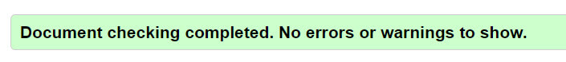
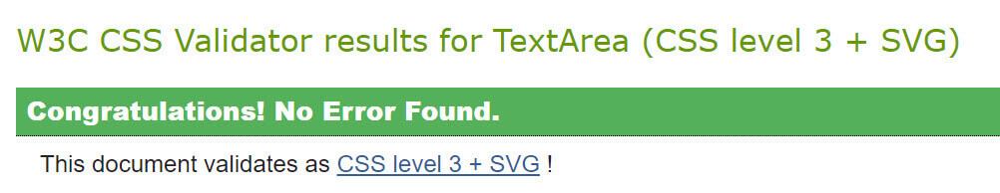

<h1 align="center">Cat Memory Game - Testing Details</h1>

[View the main README.md document](README.md)

**Please note: To open any links in this document in a new browser tab, press 'CTRL + click'.**

# Table of Contents

<b>(click to expand or hide)</b>

<!-- MarkdownTOC -->

[Testing](#testing)
* [Validators](#validators)
* [Lighthouse](#lighthouse)
* [Wave Report](#wave)
* [User Stories](#user-stories)
* [Manual Testing](#manual-testing)
* [Bugs/Fixes](#bugs-fixes)

<!-- /MarkdownTOC -->

# Testing

Testing was conducted manually and through different validator services on each page of the website.

## Validators

* [W3C Markup Validation Service](https://validator.w3.org/#validate_by_input) was used on each page 
to ensure that there were no errors or warning in my HTML document and was validated by direct input. 
I had no errors or warning on any page:

* [W3C CSS Validation Service](https://jigsaw.w3.org/css-validator/#validate_by_input) was used to ensure 
that there were no errors or warning in my CSS document and was validated by direct input. I had no errors 
or warnings display:

* [Autoprefixer CSS Online](https://autoprefixer.github.io/) was used to ensure that all vendor prefixes 
were included in CSS. The results were copied into the style.css file.

## Lighthouse

## Wave Report  

## User Stories  

## Manual testing of all elements and functionality on every page

## Bugs/Fixes  

**Home Page**

**1. Issue**:  
    I was having issues with my footer where the footer wouldn't stay at the bottom of the page.
* **Fix**: I found the answer at [freeCodeCamp](https://www.freecodecamp.org/news/how-to-keep-your-footer-where-it-belongs-59c6aa05c59c/) 
where I was advised to add a relative position to the container and an absolute position to the footer. This fixed the issue.  
There was a future issue with this - see Level 1 Page below.

**Level 1 Page**

**1. Issue**:
    Once I added the cards in, the footer kept going higher up the page. I tried lots of different changes in my css to get this to work.
    None did. 
* **Fix**: I searched Slack and found a link to a [YouTube page](https://www.youtube.com/watch?v=yc2olxLgKLk) and followed the flex 
    instructions. This has rectified the issue with my footer moving. 

**2. Issue**:
    I was having an issue when creating the cards using Bootstrap where the Bootstrap background colour kept displaying a white border 
    around the card that I didn't want.
* **Fix**: I found the answer on [Stack Overflow](https://stackoverflow.com/questions/45408037/how-to-remove-background-color-in-bootstrap) 
where I used background-color: transparent, to remove the Bootstrap default background colour.

**3. Issue**:
    When hovering over the corner of the Exit and Restart Game buttons, the button would change background colour to black, however the words would not change colour until the cursor is closer to the letters. So there was a moment when the button is all black.
* **Fix**: The issue was discussed with the channel lead for MS2 project, Scott Boning. Upon advice received I removed the div from above and below the <a> tag and placed the classes from the div in the <a> tag. This gave a smooth transition ensuring that the letters change colour immediately when hovering. The delay had been removed.

**4. Issue**:
    My cards weren't centered aligned and I had issues with the cards not being responsive.
* **Fix**: I spoke to Tutor Support and they advised me to use display: flex, which fixed the issue.

**5. Issue**:
    My buttons weren't aligned correctly.
* **Fix**: I spoke to Tutor Support and they advised me to add in a flex-row class with a display of flex, which fixed the issue.

**JavaScript**
The issues that I had with JavaScript was working out how to write the code. I did a lot of googling and found information from W3 Schools and various other places on the web. Please see the [Readme.md](README.md) credits for this information.