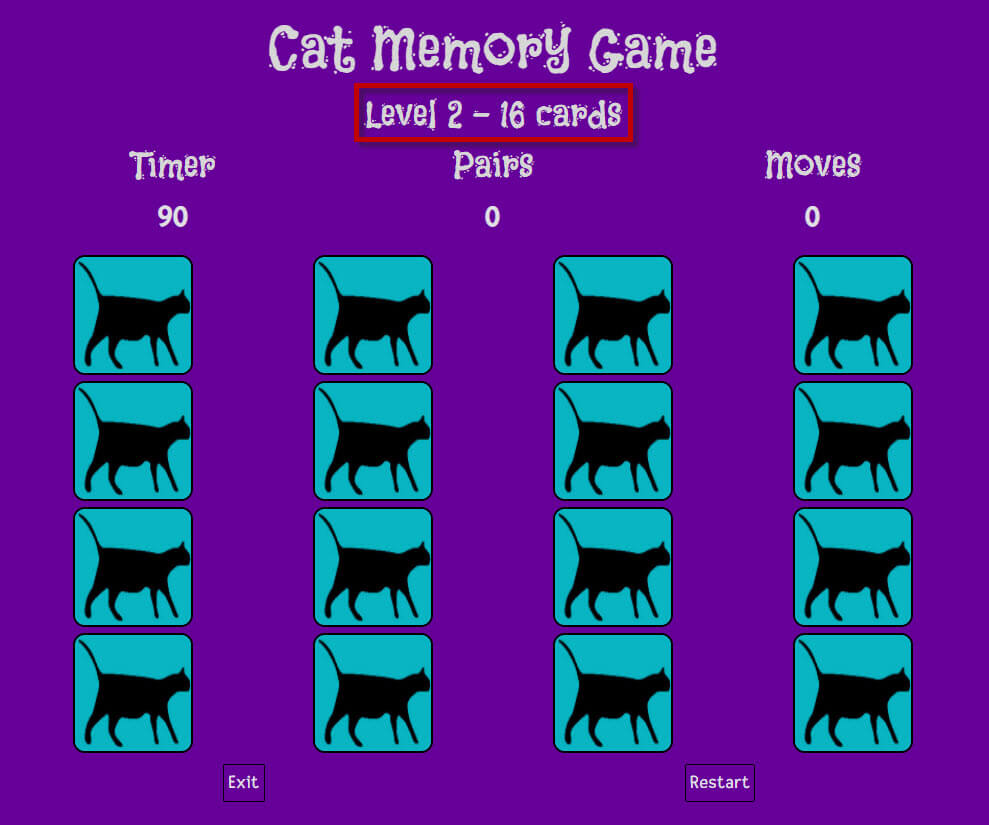

<h1 align="center">Cat Memory Game - Testing Details</h1>

[View the main README.md document](README.md)

**Please note: To open any links in this document in a new browser tab, press 'CTRL + click'.**

# Table of Contents

<b>(click to expand or hide)</b>

<!-- MarkdownTOC -->

[Testing](#testing)
* [Validators](#validators)
* [Lighthouse](#lighthouse)
* [Wave Report](#wave)
* [User Stories](#user-stories)
* [Manual Testing](#manual-testing)
* [Bugs/Fixes](#bugs-fixes)

<!-- /MarkdownTOC -->

# Testing

Testing was conducted manually and through different validator services on each page of the website.

## Validators

* [W3C Markup Validation Service](https://validator.w3.org/#validate_by_input) was used on each page 
to ensure that there were no errors or warning in my HTML document and was validated by direct input. 
I originally had a "src" error in my "img" tag in both my level1.html and level2.html but this was 
rectified. See HTML Validator Testing in Bugs/Fixes for the solution.
Upon rectification of the above, I had no errors or warning on any page:

* [W3C CSS Validation Service](https://jigsaw.w3.org/css-validator/#validate_by_input) was used to ensure 
that there were no errors or warning in my CSS document and was validated by direct input. I had no errors 
or warnings display:

* [Autoprefixer CSS Online](https://autoprefixer.github.io/) was used to ensure that all vendor prefixes 
were included in CSS. The results were copied into the style.css file.

* [JSHint.com](https://jshint.com/) was used to ensure there were no errors in my JavaScript document. 
I had one warning and one undefined variable display:

  * The undefined variable is a "bootstrap" variable. I spoke to Tutor support regarding this and was 
 advised that the code works fine and there are no console errors due to this undefined variable. It is 
 just that jshint isn't aware of the bootstrap script and doesn't import bootstrap like my project does.  

  * I also discussed the one warning with Tutor support. As per the screenshot below it is only a warning. 
 At a later stage I can update the JavaScript code to remove this warning. As it isn't an error, this 
 will be rectified at a later stage.

 

## Lighthouse

## Wave Report  

## User Stories  

### Testing User Stories from the UX section of [the main README.md document](README.md)

<b>(click to expand or hide)</b>

Each screenshot displays a red square around each item that is needed to achieve the testing criteria.

### Player Goals

1.  As a player, I would like to improve my concentration skills, improve my focus skills and improve
my attention to detail.
    * This is achieved by having similar cards on each level that relies on your concentration skills, 
focus skills and attention to detail in order to find the matching pairs. The cats either have their 
tongues poking out or are wearing glasses and in the 2nd level I have included 2 different yawning cats.

2.  As a player, I would like to have clear instructions on how to play the game.
    * This is achieved by clicking the "Instructions" link on the index.html page.

3. As a player, I would like to be able to increase the level of difficulty to improve brain functionality.
    * This is achieved by having a 2nd level with an increase of cards and 2 different cats to match.

4. As a player, I would like to exit the game at any time.
    * This is achieved by clicking the "Exit" button on either Level 1 or Level 2.

5. As a player, I would like to be able to restart the level.
    * This is achieved by clicking the "Restart" button on either Level 1 or Level 2.

6. As a player, I would like to click a card, the card flips and displays a cat picture
    * This is achieved by clicking a card on either level.

7. As a player, I would like to have the cards that matched, stay flipped so I know 
exactly how many cards are left to play.
   * This is achieved by finding a matching pair and clicking another card afterwards.

8. As a player, I would like to be able to click the cards as many times as required 
until the matching pair displays.
   * This is achieved by clicking as many cards as you like until a matching pair displays.  
    
&nbsp;

9. As a player, I would like to have fun.
   * This is achieved by playing the game and having a laugh at the cat images.

## Manual testing of all elements and functionality on every page  

### Browsers tested:

* Google Chrome
* Mozilla Firefox
* Microsoft EDGE
* Opera
* Safari  

No errors were found on the above browsers, but it is noted that there is more space between the cards on Mozilla Firefox, Microsoft EDGE and Opera. I am yet to work out a fix for these browsers so the cards are closer together. As it isn't an issue with playing the game, this is something I will look into at a later stage.

### Devices tested:

* iPhone 12
* iPhone 11
* iPhone XR
* iPhone 7
* Samsung Tablet S6
* Samsung S20 Plus
* Samsung Galaxy S10
* Samsung A3

No errors were found when testing on the above devices.

<b>(click to expand or hide)</b>

The testing below is for an end user, hence why it is in so much detail. This way anyone 
can check each step and verify the correct outcome.  

| Page      | Section       | Action        | Expected Behaviour     | Result   |  
| --------- | ------------- | ------------- | ---------------------- | -------- |  
| Home Page | Tab at top of page | On a desktop go to https://medusas71.github.io/Cat-Memory-Game/index.html | The Home Page displays; The paw prints favicon displays in the tab; the tab is named "Cat Memory Game" | Pass |  
|           | Background | The background is purple with black cats | The background is purple with black cats | Pass |  
|           | Main | There is a blue/green roundish layer on top of the background that includes the Title - Cat Memory Game and 2 links - Play and Instructions | There is a Title - Cat Memory Game and 2 links - Play and Instructions on a blue/green roundish layer on top of the background | Pass |  
|           |       | Hover over the black text on "Play" and "Instructions" | The text changes to white | Pass | 
|           |       | Click the words Play | You are taken to Level 1 of the game | Pass |  
|           |       | After returning back to the home page, click the words Instructions | A blue/green modal displays with the instructions written in black and a Close button displays | Pass |  
|           | Footer | Confirm the "copyright" information and the "developed by" information display in the middle of the footer | Copyright and developed by information displays in the middle of the footer | Pass |  
|           | Responsiveness | Go to Dev Tools and confirm the page displays correctly when you reduce and expand the margins | The correct page displays | Pass |  
|           |   | Confirm that there is no scroll bar either horizontally or vertically displayed | No scroll bar displays either horizontally or vertically | Pass |  
|           |   | Confirm that the footer is fixed | The Footer is fixed | Pass |  
| Level 1   | Tab at top of page | On a desktop go to https://medusas71.github.io/Cat-Memory-Game/level1.html | The Level 1 page displays; The paw prints favicon displays in the tab; the tab is named "Level 1 Cat Memory Game" | Pass |  
|           | Background | The background is purple | The background is purple | Pass |  
|           | Main | The name of the game as a title displays | A "Cat Memory Game" title displays | Pass |  
|           |       | Under the title, the level and number of cards display | Level 1 - 12 cards display | Pass |  
|           |       | Under the level, there is a Timer, Pairs and Moves | The words Timer, Pairs and Moves display | Pass |  
|           |       | Under the word Timer, the number 60 displays | The number 60 displays | Pass |  
|           |       | Under the word Pairs, the number 0 displays | The number 0 displays | Pass |  
|           |       | Under the word Moves, the number 0 displays | The number 0 displays | Pass |  
|           |       | Under the Timer, Pairs and Moves, 12 cards display | 12 blue/green cards showing a black cat displays in 3 rows of 4 cards on each row | Pass |  
|           |       | Under the cards 2 buttons display - Exit and Restart | The Exit and Restart buttons display | Pass |  
|           |       | Hover over the 2 buttons "Exit" and "Restart" | Upon hover the background colour changes to black on both buttons | Pass  
|           |       | Click the "Exit" button | You are taken back to the Home Page | Pass |  
|           |       | Once you have clicked "Play" from the main menu and you are back at Level 1, click any card | The card flips and a cat image displays | Pass |  
|           |       | Click the "Restart" button and click the same card that you clicked before | The page reloads, the cards shuffle and a different cat image displays | Pass |  
|           |       | Click a card | The card flips, a cat image displays, the Timer starts counting backwards from 60 and the Moves increase by 1 | Pass |  
|           |       | Click a 2nd card | The card flips and 2 flip cards display a cat image, the Timer is still counting backwards from 60 and the Moves increase by 1 for each card clicked | Pass |  
|           |       | If the 2nd card doesn't match the 1st card, click a 3rd card | The first 2 cards flip back over to display the back of the cards and the 3rd card stays flipped | Pass |  
|           |       | If the 2nd card matches the first, ensure that the Pairs increase by 1, the moves are still increasing and the timer is counting down | The Pairs increase by 1, the moves are increasing and the timer is counting down | Pass |  
|           |       | Click a 3rd card | The first 2 pairs remain flipped and the 3rd card is flipped | Pass |  
|           |       | Let the timer run out and don't click any cards | The Timer displays finished and a modal displays with a paw print emoji and the title of "Game Over" displays and the words "Time has run out - sorry you lose!" displays | Pass |  
|           |       | Click the "Close" button on the modal | You are taken back to the main Home Page of the game | Pass |  
|           |       | Click "Play" from the front menu and play the game in its entirety | The Timer countdowns and upon completion the Timer changes from the seconds remaining to Finished, The Pairs increase, The Moves increase and all pairs display | Pass |  
|           |       | Upon completion of Level 1, a blue/green Modal displays | A modal displays with a title of "Pawulations" and a paw print emoji; You are advised that "You have found all the cards" with a cat emoji; 2 buttons display - "Next Level" and "Close" | Pass  
|           |       | Hover over the 2 buttons "Next Level" and "Close" | Upon hover the background colour changes to black on both buttons | Pass  
|           |       | Click "Close" | You are taken back to the main Home Page of the game | Pass |  
|           |       | Click "Play" from the main menu and play the game again. Upon completion of Level 1, click the "Next Level" button | You are taken to Level 2 of the game | Pass |  
|           | Footer | Confirm the "copyright" information and the "developed by" information display in the middle of the footer | Copyright and developed by information displays in the middle of the footer | Pass |  
|           | Responsiveness | Go to Dev Tools and confirm the page displays correctly when you reduce and expand the margins | The correct page displays | Pass |  
|           |   | Confirm that there is no scroll bar either horizontally or vertically displayed | No scroll bar displays either horizontally or vertically | Pass |  
|           |   | Confirm that the footer is fixed | The Footer is fixed | Pass |  
| Level 2   | Tab at top of page | On a desktop go to https://medusas71.github.io/Cat-Memory-Game/level2.html | The Level 2 page displays; The paw prints favicon displays in the tab; the tab is named "Level 2 Cat Memory Game" | Pass |  
|           | Background | The background is purple | The background is purple | Pass |  
|           | Main | The name of the game as a title displays | A "Cat Memory Game" title displays | Pass |  
|           |       | Under the title, the level and number of cards display | Level 2 - 16 cards display | Pass |  
|           |       | Under the level, there is a Timer, Pairs and Moves | The words Timer, Pairs and Moves display | Pass |  
|           |       | Under the word Timer, the number 90 displays | The number 90 displays | Pass |  
|           |       | Under the word Pairs, the number 0 displays | The number 0 displays | Pass |  
|           |       | Under the word Moves, the number 0 displays | The number 0 displays | Pass |  
|           |       | Under the Timer, Pairs and Moves, 16 cards display | 16 blue/green cards showing a black cat displays in 4 rows of 4 cards on each row | Pass |  
|           |       | Under the cards 2 buttons display - Exit and Restart | The Exit and Restart buttons display | Pass |  
|           |       | Hover over the 2 buttons "Exit" and "Restart" | Upon hover the background colour changes to black on both buttons | Pass  
|           |       | Click the "Exit" button | You are taken back to the Home Page | Pass |  
|           |       | On Level 2, click any card | The card flips and a cat image displays | Pass |  
|           |       | Click the "Restart" button and click the same card that you clicked before | The page reloads, the cards shuffle and a different cat image displays | Pass |  
|           |       | Click a card | The card flips, a cat image displays, the Timer starts counting backwards from 90 and the Moves increase by 1 | Pass |  
|           |       | Click a 2nd card | The card flips and 2 flip cards display a cat image, the Timer is still counting backwards from 90 and the Moves increase by 1 for each card clicked | Pass |  
|           |       | If the 2nd card doesn't match the 1st card, click a 3rd card | The first 2 cards flip back over to display the back of the cards and the 3rd card stays flipped | Pass |  
|           |       | If the 2nd card matches the first, ensure that the Pairs increase by 1, the moves are still increasing and the timer is counting down | The Pairs increase by 1, the moves are increasing and the timer is counting down | Pass |  
|           |       | Click a 3rd card | The first 2 pairs remain flipped and the 3rd card is flipped | Pass |  
|           |       | Let the timer run out and don't click any cards | The Timer displays finished and a modal displays with a paw print emoji and the title of "Game Over" displays and the words "Time has run out - sorry you lose!" displays | Pass |  
|           |       | Click the "Close" button on the modal | You are taken back to the main Home Page of the game | Pass |  
|           |       | Go back to Level 2 and play the game in its entirety | The Timer countdowns and upon completion the Timer changes from the seconds remaining to Finished, The Pairs increase, The Moves increase and all pairs display | Pass |  
|           |       | Upon completion of Level 2, a blue/green Modal displays | A modal displays with a title of "Pawsome Work" and a paw print emoji; You are advised that "You have found all the cards" with a cat emoji; 1 "Close" button displays | Pass  
|           |       | Hover over the "Close" button | Upon hover the background colour changes to black on the "Close" buttons | Pass  
|           |       | Click "Close" | You are taken back to the main Home Page of the game | Pass |  
|           | Footer | Confirm the "copyright" information and the "developed by" information display in the middle of the footer | Copyright and developed by information displays in the middle of the footer | Pass |  
|           | Responsiveness | Go to Dev Tools and confirm the page displays correctly when you reduce and expand the margins | The correct page displays | Pass |  
|           |   | Confirm that there is no scroll bar either horizontally or vertically displayed | No scroll bar displays either horizontally or vertically | Pass |  
|           |   | Confirm that the footer is fixed | The Footer is fixed | Pass |  

## Bugs/Fixes  

**Home Page**

**1. Issue**:  
    I was having issues with my footer where the footer wouldn't stay at the bottom of the page.
* **Fix**: I found the answer at [freeCodeCamp](https://www.freecodecamp.org/news/how-to-keep-your-footer-where-it-belongs-59c6aa05c59c/) 
where I was advised to add a relative position to the container and an absolute position to the footer. 
This fixed the issue. There was a future issue with this - see Level 1 & 2 Page below.

**Level 1 & 2 Pages**

**1. Issue**:  
    Once I added the cards in, the footer kept going higher up the page. I tried lots of different 
changes in my css to get this to work. Nothing was working. 
* **Fix**: I searched Slack and found a link to a [YouTube page](https://www.youtube.com/watch?v=yc2olxLgKLk) 
and followed the flex instructions. This has rectified the issue with my footer moving. 

**2. Issue**:  
    I was having an issue when creating the cards using Bootstrap where the Bootstrap background colour kept 
displaying a white border around the card that I didn't want.
* **Fix**: I found the answer on [Stack Overflow](https://stackoverflow.com/questions/45408037/how-to-remove-background-color-in-bootstrap) 
where I used background-color: transparent, to remove the Bootstrap default background colour.

**3. Issue**:  
    When hovering over the corner of the Exit and Restart Game buttons, the button would change background colour 
to black, however the words would not change colour until the cursor is closer to the letters. So there was a moment 
when the button is all black.
* **Fix**: The issue was discussed with the channel lead for MS2 project, Scott Boning. Upon advice received I removed 
the "div" from above and below the "a" tag and placed the classes from the "div" in the "a" tag. This gave a smooth transition 
ensuring that the letters change colour immediately when hovering. The delay had been removed.

**4. Issue**:  
    My cards weren't centered aligned and I had issues with the cards not being responsive.
* **Fix**: I spoke to Tutor Support and they advised me to use display: flex, which fixed the issue.

**5. Issue**:  
    My buttons weren't aligned correctly.
* **Fix**: I spoke to Tutor Support and they advised me to add in a flex-row class with a display of flex, which fixed the issue.  

**6. Issue**:  
    Upon testing, my page had a vertical scroll bar on a desktop.
* **Fix**: I changed the size of my container and cards so the game would fit on one page without the need for a vertical scroll bar.

**JavaScript**  
The issues that I had with JavaScript was working out how to write the code and generally trying to make it work. I did a lot of googling and found information from W3 Schools and various other places on the web. Please see the [Readme.md](README.md) credits for this information.

**HTML Validator Testing**  
**Issue**:  
  * Upon creating the card-front and card-back in level1.html and level2.html, I placed both of these cards in their own "img" tag. The card-back included a "src" of where the image was kept in the Explorer menu. The card-front was obtaining the image from the JavaScript file and therefore did not need a "src". 

  * Upon testing both level1.html and level2.html in the HTML Validator I was receiving errors from the card-front "img" tag stating that I was missing a required attribute of "src". The "src" wasn't required as there was no actual image source in the html.  

**First Fix**:  
  * I asked in Slack on how I could rectify this and was told to change the "img" tag to a "div" as there was no image actually in the "img" tag as the image was coming from JavaScript via the "id".  

  * I changed all the card-front from "img" to "div" but that caused another issue as none of the front of my cards would display on the game.  

**Second Fix**:  
  * I googled ways to include an "img" tag without a "src" attribute and found a fix on [Stack Overflow](https://stackoverflow.com/questions/5775469/whats-the-valid-way-to-include-an-image-with-no-src) where I could add "src="data:," which is an empty media-type to each card-front and this   would rectify the issue.  

  * I changed all the "div" on each card-front back to "img" added the "src" attribute and an alt tag.  

  * I rechecked the code through the W3C HTML Validator and there were no errors found. So this fixed my issue.  

**Console Log Testing**  
  The game was tested whilst having the Console log open in Dev Tools on Chrome, to test for any console errors. A few errors were caught and these were discussed with my mentor as I could not work out how to rectify them.

  **Error One** 
  * Upon opening the home page, I was receiving a site.webmanifest 404 error. I googled the error but wasn't sure in how to fix this or how important the file was.

  * **Fix**: I spoke to my mentor and he advised that link wasn't needed and that I could delete it from every html file. This rectified the issue and the error was removed.

  **Error Two**
  * Upon opening the home page, I received an Upcaught TypeError that one of the destructure properties was undefined. I was very confused by this error.

  * **Fix**: I spoke to my mentor and after showing me some debugging tools he advised that as the error was only displaying on the index.html page that I can remove the javascript script from the footer as that was what is causing the error. I removed the javascript script from the footer of the index.html file and this resolved the issue.  

  **Error Three**
  * This error displayed after I had finished with my mentor. When playing the game I receive an "Error with Permissions-Policy header: Origin trial controlled feature not enabled: 'interest-cohort'.

  * **Fix**: I googled the error and found an answer on [Stack Overflow](https://stackoverflow.com/questions/69619035/error-with-permissions-policy-header-unrecognized-feature-interest-cohort) which advised me to ignore the error.

  This is the only console error when playing the game.

  